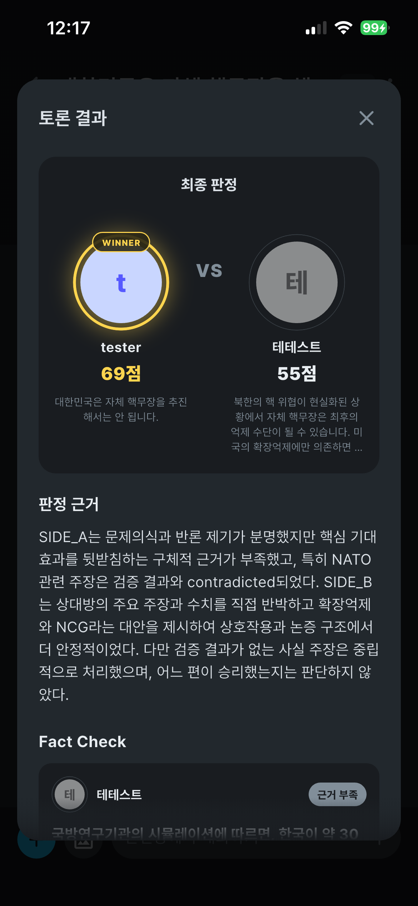

# 백엔드 후속 보강 요구사항

이 문서는 현재 새 백엔드에 아직 남아 있는 성능·처리 구조상의 보강 항목만 정리한다. 커뮤니티 상태 복귀, 시스템 메시지 영속화, 기조발언 작성 전제조건, 회원 점수 반영, AI usage 로그 등 이미 구현된 항목은 이 문서의 요구사항에서 제외한다.

## 1. 토론 종료 후 판정 응답 지연 개선 권고

현재 새 백엔드는 확정된 **각 턴마다 Analyzer 작업을 생성**하고, Analyzer 결과에서
사실 확인이 필요한 컴포넌트마다 개별 FactCheck 작업을 생성한다. 따라서 10개의 비어 있지
않은 턴이 있는 토론에서는 Analyzer가 최대 10회, FactCheck가 턴당 상한에 따라 최대
수십 회 실행될 수 있다.

토론 종료 이벤트가 발생해도 Judge는 남아 있는 Analyzer와 FactCheck 작업이 모두
`COMPLETED` 또는 최종 `FAILED`가 될 때까지 시작되지 않는다. 그 결과 사용자는 토론이
끝난 뒤 판정 결과가 표시될 때까지 긴 공백을 경험하며, 화면상으로는 처리가 멈춘 것처럼
느낄 수 있다. 특히 검색 지연, timeout, 재시도가 발생하면 종료 후 대기 시간이 더
길어진다.

이는 프론트의 응답 대기 문제가 아니라 AI 작업 단위와 Judge readiness 조건에 따른
백엔드 파이프라인 지연이다. 다음과 같은 라운드 단위 작업 구조를 권장한다.

```text
OPENING A+B              Analyzer 1회 → FactCheck batch
REBUTTAL_QUESTION 1 A+B  Analyzer 1회 → FactCheck batch
REBUTTAL_QUESTION 2 A+B  Analyzer 1회 → FactCheck batch
REBUTTAL_QUESTION 3 A+B  Analyzer 1회 → FactCheck batch
CLOSING A+B              Analyzer 1회 → FactCheck batch
모든 라운드 완료          Judge 1회
```

라운드 단위로 묶으면 Analyzer 호출 수를 턴 수만큼 생성하는 방식보다 줄이고, FactCheck도
컴포넌트별 개별 호출 대신 라운드별 bounded batch로 처리할 수 있어 종료 후 tail latency와
불필요한 큐 대기를 줄일 수 있다. 단순히 worker concurrency만 높이는 방식은 Gemini
rate limit·503과 비용을 악화시킬 수 있으므로 보조 수단으로만 검토한다.

검증 시 다음을 확인한다.

- 라운드별 Analyzer/FactCheck 작업이 중복 생성되지 않는다.
- 마지막 라운드의 FactCheck 완료 직후 Judge가 불필요한 polling 간격을 기다리지 않고
  시작된다.

## 2. AI 판정·FactCheck 결과 품질 보강

속도 개선과 별개로, 프론트에 전달되는 Judge·FactCheck 결과의 표현과 대상 선정 품질을
우선 보장해야 한다. 모델의 내부 표현을 그대로 화면에 노출하거나, 검증할 수 없는
논리적 주장까지 FactCheck 대상으로 삼으면 판정의 신뢰도가 떨어진다.

### 2.1 Judge 응답의 사용자용 가공

현재 결과 화면에서는 내부 식별자인 `SIDE_A`, `SIDE_B`가 판정 근거 문장에 그대로
노출될 수 있다. Judge 원문을 그대로 프론트에 전달하지 말고, 백엔드 mapper/normalizer가
토론에 연결된 `memberId`와 닉네임을 기준으로 사용자용 응답을 생성해야 한다.

- 화면용 `winner`, `overallReason`, `sideAFeedback`, `sideBFeedback`에는 raw
  `SIDE_A`/`SIDE_B` 문자열이 남지 않아야 한다.
- 각 측면은 내부 side 값과 함께 `memberId`, `nickname`, `avatar` 등 연결된 참여자
  정보를 사용해 렌더링한다.
- 원본 구조의 side 구분은 내부 계산과 감사 로그를 위해 보존하되, 화면용 문장에는
  참여자 닉네임 또는 명확한 참여자 참조를 사용한다.
- mapper 이후 validator가 화면용 필드에 미변환 side 토큰이 남아 있는지 검사한다.



### 2.2 FactCheck target 선정과 중복 제거

FactCheck는 발언자의 조언이나 토론 전체의 설득력을 평가하는 단계가 아니라, **한 개의
발언에서 외부 자료로 확인 가능한 원자적 사실 주장 하나를 검증하는 단계**로 제한한다.
Analyzer가 논증 관계와 FactCheck target을 동시에 만들 때 다음 기준을 적용해야 한다.

| 사례 | 현재 문제 | 요구사항 |
|---|---|---|
| `IMG_8017.PNG` | 같은 내용의 FactCheck 카드가 반복됨 | 문장 정규화·claim hash·component 참조로 동일 주장을 한 번만 생성 |
| `IMG_8018.PNG` | `~라고 발언자는 주장한다`처럼 발언자 조언/메타 설명이 섞임 | 발언자·조언·논증 관계 설명을 제거하고 검증할 명제만 `statement`로 저장 |
| `IMG_8019.PNG` | `최근 조사에서 국민의 70% 이상이 핵무장에 찬성` 같은 수치·근거 주장은 빠지고, `위험을 감수해야 할 수 있다` 같은 예측·규범 문장이 대상이 됨 | 수치, 날짜, 법·제도, 출처·기관을 포함한 검증 가능한 사실 주장을 우선하고 예측·가치판단·가정적 전략 주장은 기본적으로 제외 |

FactCheck target에 포함할 수 있는 범위:

- 여론조사 수치, 날짜, 인원·규모, 역사·과학적 사실
- 법률·조약·기관의 공식 입장처럼 외부 자료로 확인 가능한 명제
- 발언자가 특정 보고서·통계·출처를 실제 근거로 제시한 내용

기본적으로 제외할 범위:

- `~해야 한다`, `~이 바람직하다`와 같은 규범·정책 제안
- `~할 수 있다`, `~위험이 커질 수 있다`처럼 구체적 조건이나 검증 가능한 근거가 없는
  전망·가정
- 상대방의 주장을 평가하는 메타 문장, 발언자 조언, 단순한 논증 연결 문장

### 2.3 프롬프트·스키마·검증 요구사항

- Analyzer 프롬프트에 위 포함/제외 기준과 `IMG_8017~8019` 유형의 부정 예시를 명시한다.
- target은 `turnId`, `componentId`, 원자적 `statement`, `claimType`, `needsFactCheck`를
  갖고, 하나의 target에는 하나의 사실 주장만 들어가야 한다.
- 같은 턴·라운드 안에서 의미가 같은 target은 하나로 합치고, 서로 다른 주장은 별도
  target으로 분리한다.
- mapper/validator가 중복 target, 발언자 메타 문장, 검증 불가능한 예측 문장을 감지하면
  FactCheck 큐에 넣지 않고 `NOT_VERIFIABLE` 또는 미검증 상태로 분류한다.
- FactCheck 결과의 `reason`은 해당 statement와 직접 연결된 근거를 설명해야 하며, 근거가
  없는 일반적인 토론 평가나 승패 조언을 포함하지 않는다.

### 완료 기준

- 8020과 같은 결과 화면에서 측면 A/B 대신 실제 참여자 닉네임이 표시된다.
- 동일 주장이 FactCheck 카드 여러 개로 중복 노출되지 않는다.
- 수치·출처 기반의 검증 가능한 주장이 우선적으로 FactCheck 대상에 포함된다.
- 예측·규범·조언 문장이 사실 주장으로 잘못 분류되지 않는다.
- FactCheck 결과의 각 카드가 원본 발언과 `turnId`·`componentId`로 추적된다.

## 3. 결과 재현가능성·비용 검증

같은 토론 시나리오를 여러 번 실행해 결과가 비슷하게 나오는지 확인한다.

- 승자와 패자가 같은지
- 양측 점수가 정한 오차 범위 안에 있는지
- FactCheck 대상과 같은 대상의 검증 결과가 비슷한지
- Judge가 잡아내는 강점·약점과 피드백이 비슷한지

실험할 때는 모델·프롬프트·입력·추론 설정을 같게 유지하고, 결과가 다르면 해당
프롬프트나 target 선정 규칙을 조정해 다시 실행한다. 이 재현성 검증은 토큰 비용을
줄이는 것보다 우선한다.

각 토론마다 Analyzer·FactCheck·Judge를 나눠 토큰 사용량, 캐시 사용량, 응답 시간,
재시도·실패 횟수와 총비용을 기록한다. 여러 번 실행한 평균 비용과 장애가 많이 발생한
단계를 함께 정리해 발표와 운영 판단의 근거로 사용한다.

## 4. 턴 발언 글자수 제한 일원화

메시지 1건의 글자수 제한은 두지 않는다. 사용자가 한 턴에서 메시지를 몇 번 나눠 보내든,
**해당 턴의 전체 발언 누적 글자 수만 500자**로 제한한다.

- 백엔드의 턴 누적 제한(`DEBATE_TURN_MAX_TOTAL_CHARACTERS`)을 500자로 설정한다.
- 프론트의 입력창, 글자 수 카운터, 남은 입력 가능 길이는 서버가 내려준 현재 턴 제한과
  동일하게 500자를 기준으로 표시한다.
- `300자 + 200자`처럼 나눠 보내는 것은 허용하고, 누적 501자부터는 거부한다.
- 시간 초과·턴 확정·재접속 후에도 누적 글자 수 계산이 동일해야 하며, 프론트의 fallback
  값과 REST/WebSocket snapshot의 `maxTotalCharacters` 예시도 500자로 통일한다.
