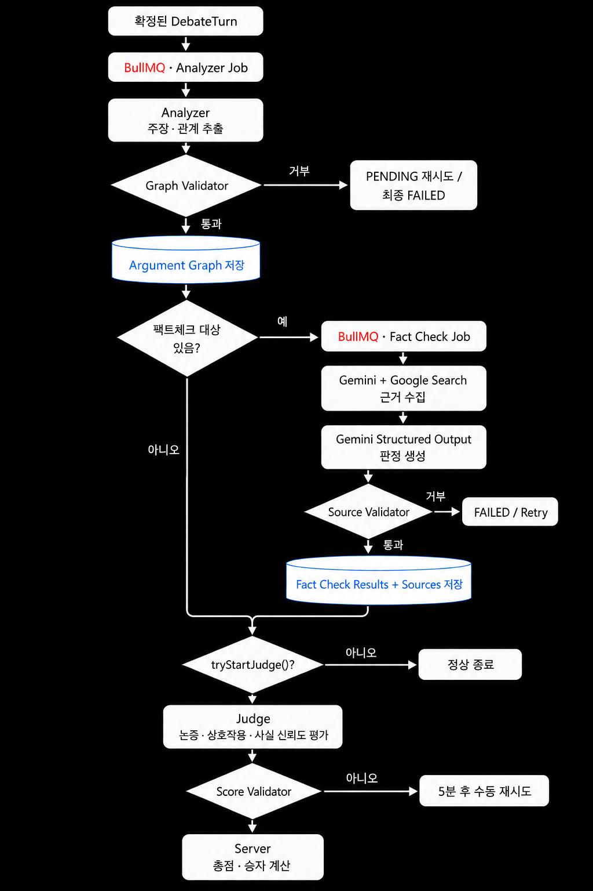
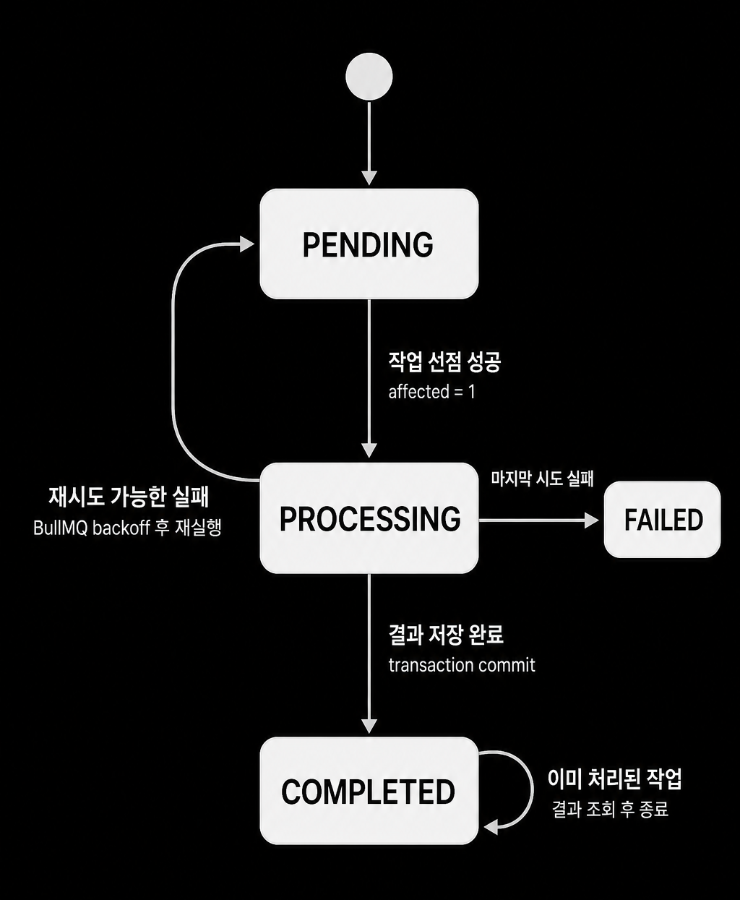

# Heimdall 백엔드 내부 구현 설계

이 문서는 [프론트엔드 API 계약](./frontend-api-contract.md)을 만족시키기 위한 백엔드 내부 설계와 현재 구현 예시다. 아래 내용은 프론트가 직접 의존하는 wire contract가 아니며, 내부 저장소·큐·동시성 구현은 변경할 수 있다.

## 현재 구조 참고 이미지

아래 이미지는 저장소 `readme_img`에 있는 현재 구현 기준 다이어그램이다. API 계약 자체를 대체하지 않으며, 내부 흐름을 빠르게 파악하기 위한 참고 자료다.

### 전체 AI 처리 파이프라인

Analyzer → FactCheck → Judge 흐름과 readiness/상태 전이를 전체적으로 확인할 때 사용한다.

### 토론 채팅·턴 확정 흐름

Redis draft append, 턴 finalize, DB 확정과 WebSocket 이벤트 경계를 확인할 때 사용한다.

### 토론 상태 머신

서버가 현재 phase/round/turn과 전체 토론 종료 상태를 어떻게 전이시키는지 확인할 때 사용한다.

### AI worker 상태

Analyzer·FactCheck·Judge 작업의 pending/processing/completed/failed 및 recovery 흐름을 확인할 때 사용한다.

## 프론트 화면 지원 처리 로직

### 인증·세션

- 보호된 REST와 WebSocket handshake에서 Bearer access token을 검증한다.
- access token 만료 시 refresh token rotation을 수행하고 이전 refresh token 재사용을 무효화한다.
- logout은 refresh session을 revoke하며 이미 무효인 토큰에도 멱등적으로 204를 반환한다.

### 커뮤니티·초대

- 목록/상세의 사용자별 `isOwnedByCurrentUser`, `isJoined`, `memberCount`, `participantPreviews`를 계산한다.
- join/leave와 debate intent 변경은 반복 호출에도 상태가 깨지지 않게 처리한다.
- 커뮤니티당 pending invitation 하나만 허용하고, 서버 `expiresAt` 기준으로 5초 초대 만료를 판정한다.
- 요청/수락/거절/만료를 중복 처리하지 않으며, 대상 사용자에게 올바른 targeted event를 보낸다.

### 토론 상태·턴

- `READY → IN_PROGRESS → DEBATE_FINALIZED → JUDGING → COMPLETED/FAILED` 상태 전이를 일관되게 관리한다.
- 현재 phase/round/turn side와 시작 시각을 갱신하고 `sequence`로 턴 순서를 보장한다.
- 턴/전체 시간 초과와 기권을 서버에서 판정하고 `debate.ended` 및 커뮤니티 시스템 메시지를 발행한다.
- 현재 발언자·phase·round가 일치할 때만 draft/finalize를 허용한다.

### 채팅·멱등성·복구

- 커뮤니티 메시지는 `clientMessageId` 기준으로 중복 저장하지 않는다.
- 토론 draft는 append 순서와 누적 글자 수를 원자적으로 관리하고 finalize 중 append를 차단한다.
- 재접속 시 토론 snapshot, 커뮤니티 최근 메시지/의견을 replay한다.
- event/entity ID를 사용해 replay와 실시간 이벤트의 중복 반영을 방지한다.

### AI 파이프라인

- Analyzer·FactCheck·Judge의 시작/재시도/완료/실패를 `debate.processing.stage`로 broadcast한다.
- readiness 확인과 task/batch 상태 변경은 멱등적으로 처리해 중복 job을 만들지 않는다.
- Judge는 모든 필수 fact-check/synthesis가 완료된 뒤 한 번만 시작하며 진행 중 조회에는 409를 반환한다.
- 결과 저장과 상태 변경은 트랜잭션 또는 조건부 update로 묶어 recovery scheduler와의 경합을 방어한다.

## WebSocket broadcast 설계 요구사항

| 상황 | 전달 범위 | 대표 이벤트 |
|---|---|---|
| 토론 draft 생성 | 같은 debate room, 송신자 제외 | `debate.turn.message.created` |
| draft ACK/오류 | 요청 socket만 | `debate.turn.message.ack`, `error` |
| 턴 확정/진행상태 | debate room 전체 | `debate.turn.finalized`, `debate.processing.stage` |
| 토론 종료 | debate room 및 community room | `debate.ended` |
| 커뮤니티 메시지 | community room, 송신자 제외(ACK는 송신자) | `message.created`, `community.message.ack` |
| 의견 변경 | community room 전체(ACK는 송신자) | `opinion.submitted`, `community.opinion.ack` |
| 초대 요청/거절/만료 | 대상 member socket | `debate.requested`, `debate.request.rejected`, `debate.request.expired` |

- handshake에서 token과 URL의 room ID를 검증한 뒤 room에 등록한다.
- 단일 room publish 경로로 순서를 보장하고, command/event ID로 중복 broadcast를 막는다.
- 수평 확장 시 Redis Pub/Sub 또는 동등한 WebSocket adapter를 사용한다.

## 현재 구현 예시

- `DebateChatWebSocketServer`가 `rooms`, `communityRooms`, `communitySocketMembers` 메모리 map을 관리한다.
- `broadcast`, `broadcastExcept`, `broadcastCommunity`, `broadcastExceptCommunity`, `sendToCommunityMember`로 위 routing을 구현한다.
- `DebateProcessingEventBus` subscriber가 stage 이벤트를 debate room에 전달한다.
- `CommunityNotificationService`가 `community_message` 저장 결과를 WebSocket 이벤트로 발행한다.
- 연결 직후 토론은 `connection.restored`, 커뮤니티는 최근 `message.created`/`opinion.submitted` 이벤트를 replay한다.
- 현재 room map은 프로세스 로컬이며, 다중 인스턴스 Pub/Sub adapter는 운영 확장 과제다.

## DB·Redis·BullMQ 구현 참고

| 용도 | 저장 위치 |
|---|---|
| 커뮤니티 채팅/시스템 알림 | `community_message` |
| 커뮤니티 의견 | `community_opinion` |
| 확정 토론 발언 | `debate_turn` |
| 현재 토론 상태 | `debate` |
| draft/글자 수/중복 방지/finalize lock | Redis (`debate-chat:*`) |
| Analyzer·FactCheck·Judge 비동기 작업 | BullMQ + Redis |

`debate.processing.stage`는 현재 event bus broadcast만 하며 영속 저장하지 않는다. 재접속 후 stage 이력까지 복원하려면 stage history 테이블 또는 snapshot API가 필요하다.

## 운영·오류 처리

- UUID/enum/길이 오류는 400, 인증 실패는 401, 권한 부족은 403, 상태 충돌은 409, AI upstream/응답 형식 오류는 502 계열로 구분한다.
- 목록과 메시지는 `createdAt`/`sequence` 순서를 명시하고 pagination tie-breaker를 둔다.
- timeout, retry, stale recovery 상수는 환경변수로 관리하고 시작 로그에 실제 값을 출력한다.
